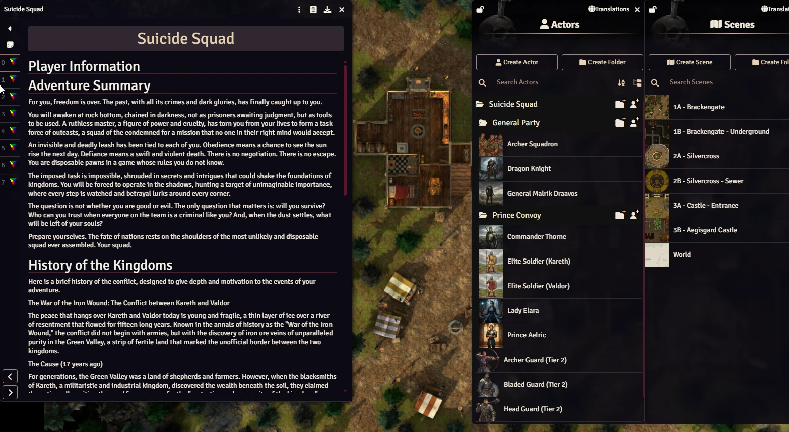

# Suicide Squad (Daggerheart Adventure)
Torn from your past lives, you are a squad of criminals forced to serve a ruthless master. A deadly curse ensures your obedience, turning you into disposable pawns for an impossible mission. You are tasked with hunting a target of unimaginable importance in a land on the brink of war. Operating in the shadows where every step is watched, you must fight for survival and decide whether to obey your orders or risk everything to change your fate.

This module includes maps and npcs with art.

  

# About
## Adventure Summary
For you, freedom is over. The past, with all its crimes and dark glories, has finally caught up to you.

You will awaken at rock bottom, chained in darkness, not as prisoners awaiting judgment, but as tools to be used. A ruthless master, a figure of power and cruelty, has torn you from your lives to form a task force of outcasts, a squad of the condemned for a mission that no one in their right mind would accept.

An invisible and deadly leash has been tied to each of you. Obedience means a chance to see the sun rise the next day. Defiance means a swift and violent death. There is no negotiation. There is no escape. You are disposable pawns in a game whose rules you do not know.

The imposed task is impossible, shrouded in secrets and intrigues that could shake the foundations of kingdoms. You will be forced to operate in the shadows, hunting a target of unimaginable importance, where every step is watched and betrayal lurks around every corner.

The question is not whether you are good or evil. The only question that matters is: will you survive? Who can you trust when everyone on the team is a criminal like you? And, when the dust settles, what will be left of your souls?

Prepare yourselves. The fate of nations rests on the shoulders of the most unlikely and disposable squad ever assembled. Your squad.

## History of the Kingdoms
Here is a brief history of the conflict, designed to give depth and motivation to the events of your adventure.

The War of the Iron Wound: The Conflict between Kareth and Valdor

The peace that hangs over Kareth and Valdor today is young and fragile, a thin layer of ice over a river of resentment that flowed for fifteen long years. Known in the annals of history as the "War of the Iron Wound," the conflict did not begin with armies, but with the discovery of iron ore veins of unparalleled purity in the Green Valley, a strip of fertile land that marked the unofficial border between the two kingdoms.

The Cause (17 years ago)

For generations, the Green Valley was a land of shepherds and farmers. However, when the blacksmiths of Kareth, a militaristic and industrial kingdom, discovered the wealth beneath the soil, they claimed the entire valley, citing the need for resources for the "protection and prosperity of the kingdom." Valdor, an older, more traditional kingdom, responded with centuries-old treaties that proved their sovereignty over at least half of those lands. Diplomacy failed, rhetoric flared, and Kareth's first pickaxe into the valley's soil was seen as the first strike of a war axe.

The Years of Bleeding (15 years of war)

The war was brutal and divided into three distinct phases:

The Blade's Offensive (Years 1-4): Kareth, with its better-equipped army and aggressive doctrine, invaded the Green Valley with overwhelming force. They gained ground quickly, expecting a swift capitulation from Valdor. However, they underestimated the resilience of the people of Valdor, who, fighting on their own territory, turned every hill and forest into a deadly trap.

The Meat Grinder (Years 5-12): Kareth's offensive stagnated, and the war turned into a conflict of attrition. Colossal battles for mere meters of muddy land became commonplace. Fortresses were besieged for years, villages were taken and retaken dozens of times, and the fertile fields of the valley were sown with blood and steel. It was in this phase that an entire generation of youth from both kingdoms was lost. General Malrik Draavos rose through the ranks of Kareth during this period, becoming known for his cruelty and tactical efficiency.

The Silent Collapse (Years 13-15): After more than a decade of total war, both kingdoms were on the brink of collapse. The coffers were empty, abandoned farms led to famine, and the population, exhausted from mourning, no longer supported the conflict. The war did not end with a decisive battle, but rather with a collective groan of exhaustion.

The Fragile Truce (2 years ago to the present)

Two years ago, under pressure from exhausted nobles and a starving populace, the monarchs of Kareth and Valdor agreed to the "Armistice of the Burned Fields." It was not a peace treaty, but a simple truce. The weapons fell silent, but the central issue—the ownership of the Green Valley—was never resolved. The valley became a no-man's-land, a demilitarized scar between the kingdoms.

Today, the truce is defended by those who remember the cost of the war, like the idealistic Prince Aelric. However, on both sides, there are "war hawks," men like General Draavos, who see the truce not as peace, but as a humiliating pause. For them, the fifteen years of sacrifice will only have been worthwhile with total victory, and the Iron Wound must be reopened so that it can, once and for all, be "healed" in favor of their kingdom.

## Character Creation: The Condemned
In this adventure, you are not heroes. Each of you has a past stained by deeds that have marked you as an enemy of the kingdom. You are outcasts, pariahs in the eyes of the law and society.

During character creation, you must decide on the significant crime (or crimes) that led to your capture. You can create your own or choose from the suggestions below:
- Theft of a priceless noble heirloom
- Assassination for hire
- Treason against the Crown
- Espionage for the rival kingdom of Valdor
- Desertion during the War of the Iron Wound
- Smuggling of forbidden artifacts or substances
- The practice of forbidden sorcery

All characters for this adventure begin at Level 4. This reflects your experience and the notoriety that ultimately led to your capture.

# Instalation

## Search Foundry VTT Modules
1. Search for **Suicide Squad (Daggerheart Adventure)**

## Instalação Manual
1. Go to **Modules** and use the link: 
https://raw.githubusercontent.com/brunocalado/suicide-squad-daggerheart-adventure/main/module.json

# How To 
Import the compendiums inside de module to the world.

# More Adventures!
## I Wish (Daggerheart Adventure)
A wealthy merchant has been cursed and is doomed to die within a few weeks. The only hope of breaking the curse lies in a legendary artifact said to rest deep within a mountain. With time running out, the merchant is organizing one final expedition to retrieve the item—or die trying. He has summoned a group of remarkable individuals to undertake this perilous mission.

Search for **I Wish (Daggerheart Adventure)** in Foundry VTT modules.

# Changelog
You can read changes at [CHANGELOG](CHANGELOG.md)

# License

This work is published under the terms of the Darrington Press Community Gaming (DPCGL) License, available at http://www.darringtonpress.com/license

The maps are from Dungeon Alchemist and are under their license: https://www.dungeonalchemist.com/terms-of-use

The NPC images are done using AI. So, they are under https://creativecommons.org/publicdomain/zero/1.0/

# Mestre Digital
About this module creator: https://sites.google.com/view/mestredigitalmodules